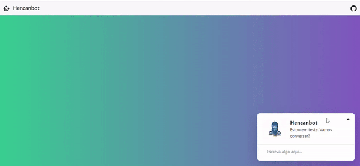

# Hencan Bot

Bot funcional em Rails 6 e gem ProgramR.

## Instalação

Irei publicar o container Docker em breve.

Clonar o repositório `chatbotRails`, restaurar as dependências com `npm install` ou `yarn install` e `bundle install`.

Iniciar o servidor com `rails s`.

## Configuração

...

## Instruções de conversação com o bot:

Saudações aceitas, digite: `Oi`, `olá`, `tudo bem`...

Você pode responder o Bot com o seu nome, digite `Meu nome é Henrique`, `Sou Roberto` ou `Me chamo Hencan`.

O Bot sabe o nome dele, pergunte digitando `Como você se chama`, `Quem é você`.

## Pendências

Digite `ajuda` para acessar os cards sobre os comandos aceitos.

Para contagem de números, digite: `Conte de 3 a 10` ou `Conte até 5`.
(Atenção: O Bot só conta de 0 a 20 e em ordem crescente.)

Sobre datas, digite: `qual a data de hoje` ou `qual dia é hoje`.

Uma coisa legal, o Bot conhece algumas piadas, digite: `Contar piadas` ou `Contar piada`, o bot irá responder, depois você digita `Me conta uma piada` ou `Conta uma`.

