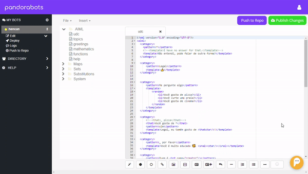

# Hencan Bot

Este bot foi criado unicamente para fins acadêmicos e participação de um desafio.

## Instalação

...

## Configuração

...

## Instruções de conversação com o bot:

Digite `ajuda` o para ajuda.

Saudações aceitas, digite: `Oi`, `olá`, `tudo bem`...

Contagem de números, digite: `Conte de 3 a 10` ou `Conte até 5`.

Sobre datas, digite: `qual a data de hoje` ou `qual dia é hoje`.

*************************************************************************************************

# Hencan Bot

This bot was created solely for academic purposes and to participate in a challenge.

## Installation

...

## Configuration

...

## Conversation instructions with the bot:

Type `help` or for help.

Accepted greetings, type: `Hi`,` hello`, `alright` ...

Counting numbers, type: `Count from 3 to 10` or` Count to 5`.

For dates, type: `what is today` or` what day is today`.
